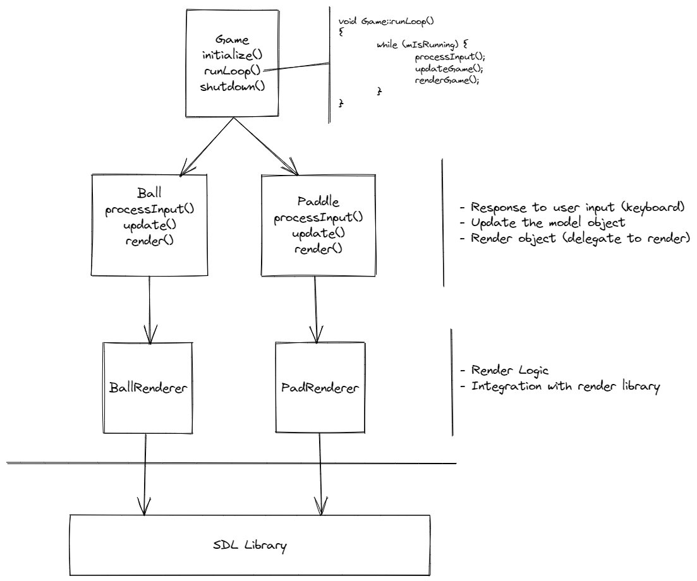

# Pong Game

That is the famous "Hello World" for game developers.
It is because despite being extremely simple, some important concepts of Games are covered.
Specially the famous Game Loop, that stay infinitely processing user input (keyboard, mouse, joistick), apply changes on model elements of game (due to user input), and finally render elements on screen.

This simple game uses SDL library [https://www.libsdl.org/] for render on screen the game.
The image below try to communicate the main elements and their responsabilities:

Hope this sample can help to understand the essense of game programming, at least the old ones ;).

More can be read on the excelent book, [Game Programming in C++: Creating 3D Games (Game Design)](https://www.amazon.com/Game-Programming-Creating-Games-Design/dp/0134597206)